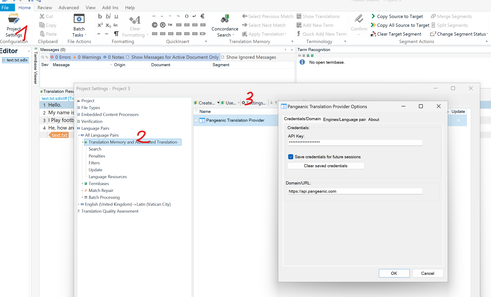
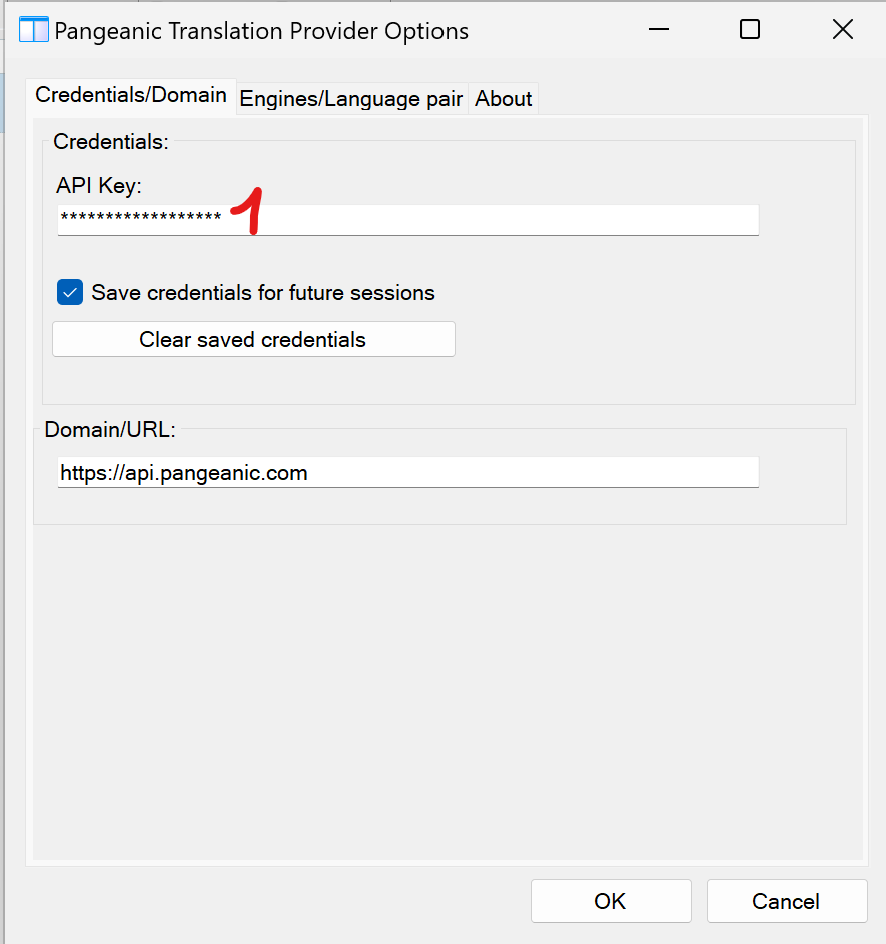
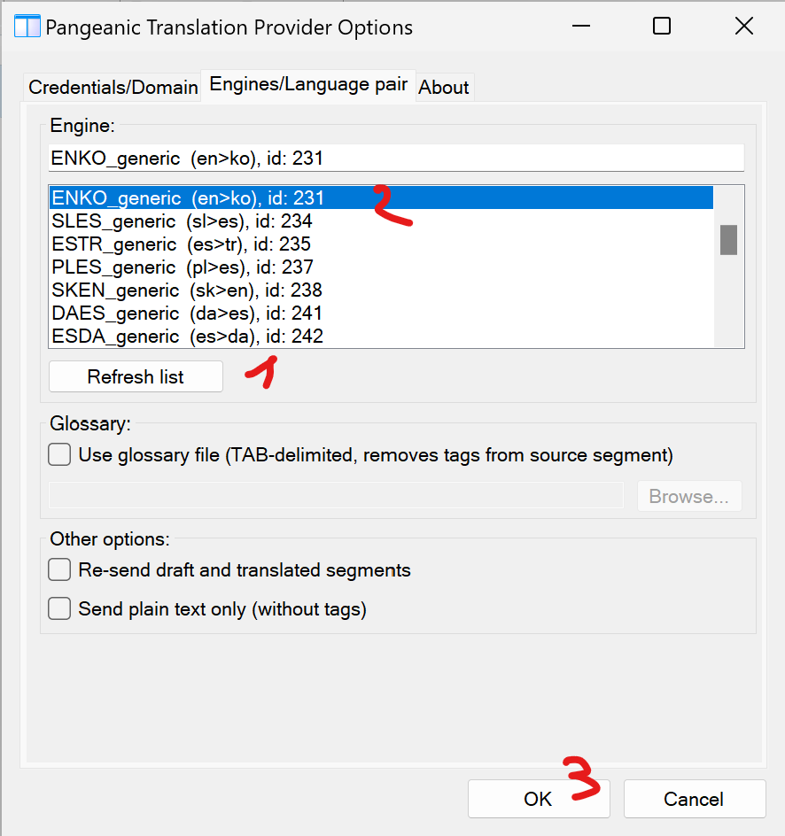

#  Trados Plugin - Public repository 

A Translation provider for Trados made by Pangeanic.

## About versions

There is a release of our plug-in for each version of Trados listed below:

| Trados commercial version | Trados internal version 
|---|---|
| Trados 2024 | >=18 |
| Trados 2022_SR2 | >=17.2 <18 |
| Trados 2022 | >=17.0 <17.1  |

Other versions of Trados are not supported or not supported anymore.

## How to install our plug-in?

### Step 1: Previous version of the plug-in

If this is your first time installing our plug-in, you can skip this step.

When updating our plugin to a new version, it's essential to delete the 'unpacked' version of the plug-in that Trados creates automatically when a new plugin is detected.

Unpacked versions of all Trados' plug-ins are located there:

| Trados commercial version | Trados internal version  | Download 
|---|---|---|
| Trados 2024 | >=18 | C:\Users\MYUSER\AppData\Roaming\Trados\Trados Studio\18\Plugins\Unpacked |
| Trados 2022_SR2 | >=17.2 <18 | C:\Users\MYUSER\AppData\Roaming\Trados\Trados Studio\17\Plugins\Unpacked |
| Trados 2022 | >=17.0 <17.1  | C:\Users\MYUSER\AppData\Roaming\Trados\Trados Studio\17\Plugins\Unpacked |

Note: Replace `MYUSER` by your Windows username.

Note: `C:\Users\MYUSER\AppData` directory is hidden by default in windows.

### Step 2: Download the plug-in

The plugin is just a file with the .sdlplugin extension. It is necessary to download the plugin that corresponds to your Trados version:

| Trados commercial version | Trados internal version  | Download from github | Download from RWS appStore |
|---|---|---|---|
| Trados 2024 | >=18 | [Download](https://github.com/PangeanicAI/trados-plugin/releases/download/Trados2024_1.0.0/PangeanicTranslationProviderTrados2024.sdlplugin) | [Download](https://appstore.rws.com/plugin/415?lang=en)
| Trados 2022_SR2 | >=17.2 <18 | - | - |
| Trados 2022 | >=17.0 <17.1  | - | - |

All the releases of our plug-in are published [here](https://github.com/PangeanicAI/trados-plugin-public/releases).

### Step 3: Install the plug-in

Just copy the file downloaded in step 2 to the appropriate folder:

| Trados commercial version | Plug-in directory
|---|---|
| Trados 2024 | C:\Users\MYUSER\AppData\Roaming\Trados\Trados Studio\18\Plugins\Packages |
| Trados 2022_SR2 | C:\Users\MYUSER\AppData\Roaming\Trados\Trados Studio\17\Plugins\Packages |
| Trados 2022 | C:\Users\MYUSER\AppData\Roaming\Trados\Trados Studio\17\Plugins\Packages |

Note: Replace `MYUSER` by your Windows username.

Note: `C:\Users\MYUSER\AppData` directory is hidden by default in windows.

## Usage

### Step 1:
Open the configuration panel:

### Step 2:
Enter your API key:

### Step 3:
Select the translation engine:

